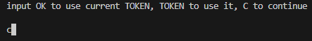
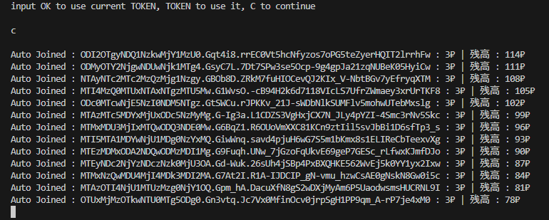
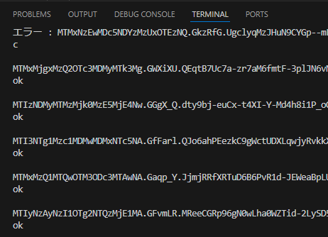
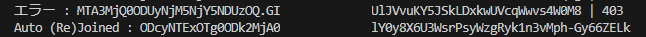
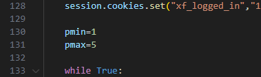
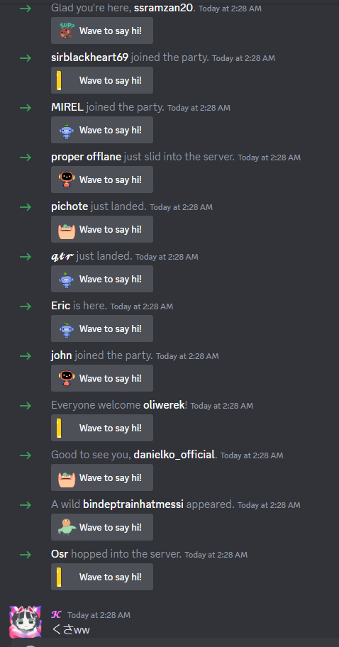
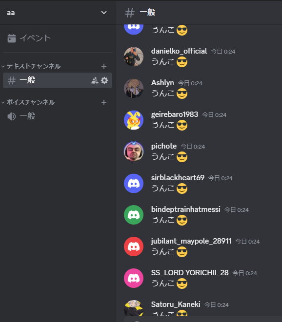

# lolz-Discord-Spammer-memo
自分が使い方忘れない用と、友達に説明する時用
## いるもの
- lolzアカウント
- (クリーンな)ローテーションプロキシ
#### Python
- tls_client
- httpx
- bs4
- pycryptodome
## 使い方
コードの1番下のとこ
```py
asyncio.run(run("メッセージ内容","招待コード","lolzのxf_user","lolzの秘密の質問","joiner用のきれいなローテーションプロキシ","lolzとスパム用のプロキシ",
"スパムしたいチャンネルID (リストでも可能) 入力しないと全チャンネルにスパムする","スパムする文字列にランダムなuuid4をつけるかどうか","スパムする間隔"))
```
書いてある通りに入力する  
入力しないとNoneとかFalseが投げられる  
(クリーンな)ローテーションプロキシを使わないとJoiner機能が死ぬから注意する  
lolzとスパム用のプロキシは遅すぎなければなんでも  
##### 実行する  
  
英語で書いてるし```ok```と```TOKEN```と```c```しか案内されてないけどコマンドはもっとある  
```c```を入力しないとlolzからアカウントを調達してこない
#### 前提の仕様
lolzからアカウントを調達すると```account_list```というリストにトークンが格納される  
```ok```コマンドは```account_list```の0番目から引っ張ってくるので```c```コマンドを使う時は少し注意  
使ったトークンは同じディレクトリーにある```token.txt```に書き込まれる  
死んだトークンと、認証が要求されたトークンは削除される  
次回起動の時に同じディレクトリーにある```token.txt```がロードされて、書き込まれているすべてのトークンでサーバー参加・スパムを開始する  
Auto Joinが成功すると、次のアカウントを自動で調達してくる
#### コマンド
- ```ok```  
  Auto Joinに失敗した時だけ使う  
  Auto Joinに失敗したアカウントのトークンが表示された時、手動でサーバーに参加してから```ok```と入力するとそのアカウントでスパムが開始される  
  ```ok```を入力すると次のトークンが自動でlolzから調達される  
- ```TOKEN```  
  トークンを入力したら、入力したトークンでスパムを開始する  
  スパムしたいサーバーに参加されてない時は自動で参加するけど、キャプチャが出たら失敗で終わり...  
- ```c```  
  continueの略  
  入力すると現在のタスクに関係なくlolzでアカウントを調達してくる  
- ```p```  
  pauseの略  
  ```ok```と同じく```account_list```の0番目にあるトークンでスパムを開始するけど、その後lolzからトークンを調達せずにただスパムだけをする  
- ```e```  
  endの略  
  すべてのタスクを終了する  
  これで終了した時```account_list```にトークンが残っていると、```token.txt```に書き込まれる
- ```k```  
  killの略  
  最後に実行されたlolzのタスクを終了する  
  Auto Joinに成功すると次のアカウントが自動で調達されるので、それを終了させたりする  
### token.txtをロードする
  
同じディレクトリーに```token.txt```があると中身のトークンをロードしてスパムを開始する  
サーバーに参加してなかった場合は自動参加しようとするけど、失敗したらエラーと表示されてスパムされない  
スパムするときは一貫して死亡したトークンを```token.txt```から削除する  
### Auto Join
  
lolzから買ったアカウントはサーバーに自動で参加させられる  
自動参加が成功すると次のアカウントが調達されてまた参加させられる  
放置しておくだけでどんどんアカウント追加・スパムされていくので不要になったら```k```コマンドでlolz自動購入を終了する  
クリーンなローテーションプロキシがないとまともに動かない (重要)  
### Auto Join失敗
  
Auto Joinにしっぱいすると```Auto Joined : ```の表記が出ずにトークンとlolzの残高が表示される  
手動でサーバーに参加した後```ok```を入力すると、表示されているトークンでスパムが開始される  
```c```を入力すると失敗を無視してlolzからアカウントを調達してくる  
### Auto (Re)Join  
  
lolzアカウントの持ち主がサーバーから抜けると403 (Missing Access)が返される  
その時にまたサーバーに自動参加して成功するとこのログが流れる  
```token.txt```をロードした時の自動参加でもこのログが流れる、だから(Re)  
### lolzアカウントの値段  
  
```pmin```が最低価格、```pmax```が最高価格  
指定した値段幅にアカウントが存在しない場合、```pmax```が1ルーブル引き上げられてアカウントが調達される  
### 小ネタ
スパムするメッセージを入力しない (Noneじゃなくて"") と、スパムなしでアカウントだけ買って```token.txt```に保存するだけのコードになる  
招待コードを入力しない (Noneじゃなくて"") と、Auto Joinを使わなくなる  
要するに、スパムメッセージなし + 招待コードあり だとただサーバーに参加するだけのコードになる  
トークンロード+Joinerで一気に荒らしたい時用に、トークンをためよう
## その他
lolzから無限の兵力を調達できる上、ローテーションプロキシでキャプチャ回避と同時にBAN回避もできるからGood  

